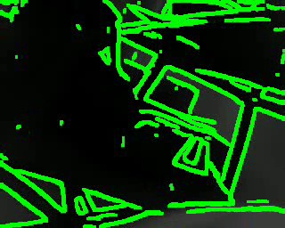
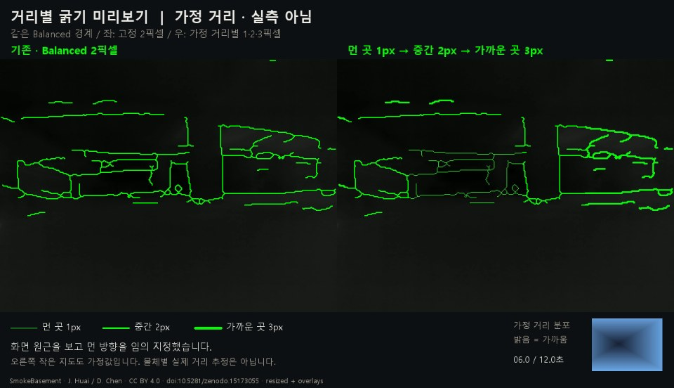
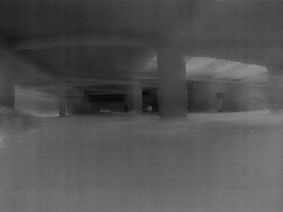
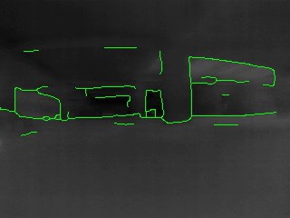
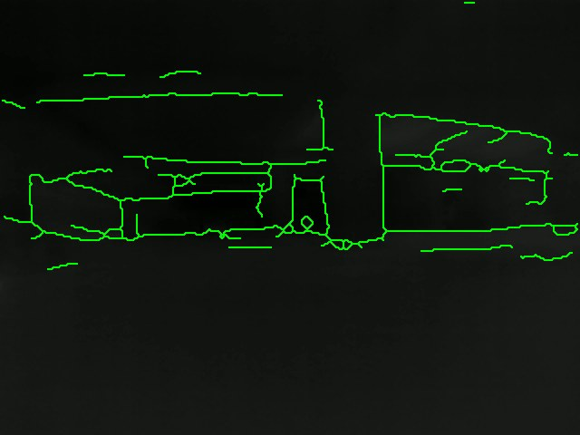
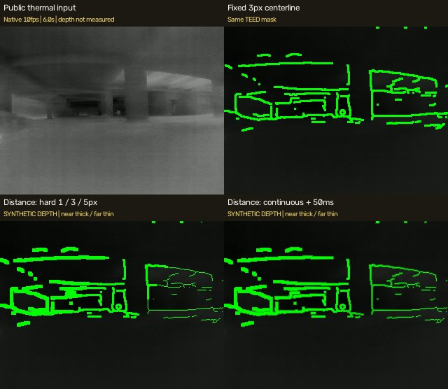

# 열화상 영상 안내

[브라우저 갤러리](https://yusihyeon.github.io/ThermalCameraResearch/gallery.html) · [연구 보고서](README.md) · [출처](docs/SOURCE_CREDITS.md)

원본 보존 MP4는 Release에서 내려받고, 저장소에서는 축소한 H.264/VP9 미리보기를 볼 수 있습니다. `smoke-original`도 공개 원 데이터에서 선정·재표본화한 클립이며 전체 센서 원본이 아닙니다. 현장 휴대폰 영상은 로컬에만 보존했습니다.

## Boson HUD 보존 영상

직접 제공된 초록 윤곽 HUD 영상입니다. 이미 합성된 표시 결과로, 원시 센서나 절대온도 자료가 아닙니다.

10.00초 · 320×256 · 9fps · 자체 실험 보존본

[미리보기 MP4](public-media/boson-test.mp4) · [보존 MP4 다운로드](https://github.com/YuSihyeon/ThermalCameraResearch/releases/download/thermal-media-2026-09-16/boson-test.mp4)

## 거리별 굵기 · 가정 거리 시연

거리 조건은 가정값입니다. 열화상에서 거리를 복원하거나 레이더를 실측 연동한 결과가 아닙니다.

12.00초 · 1280×736 · 10fps · SmokeBasement · Jianzhu Huai (2025) · CC BY 4.0 · 선택·재표본화/처리 파생물

[미리보기 MP4](public-media/distance-preview.mp4) · [보존 MP4 다운로드](https://github.com/YuSihyeon/ThermalCameraResearch/releases/download/thermal-media-2026-09-16/distance-preview.mp4)

## 농연 입력 · SmokeBasement

공개 열화상 데이터에서 선정·재표본화한 입력 구간입니다. 직접 Boson으로 촬영한 농연 실험과 구분합니다.

12.00초 · 320×240 · 10fps · SmokeBasement · Jianzhu Huai (2025) · CC BY 4.0 · 선택·재표본화/처리 파생물

[미리보기 MP4](public-media/smoke-original.mp4) · [보존 MP4 다운로드](https://github.com/YuSihyeon/ThermalCameraResearch/releases/download/thermal-media-2026-09-16/smoke-original.mp4)

## TEED 구조 경계 후처리

농연 입력의 경계를 선택·세선화한 출력입니다. 선 점유율 감소는 장애물 검출 정확도 향상률이 아닙니다.

12.00초 · 320×240 · 10fps · SmokeBasement · Jianzhu Huai (2025) · CC BY 4.0 · 선택·재표본화/처리 파생물

[미리보기 MP4](public-media/smoke-structural.mp4) · [보존 MP4 다운로드](https://github.com/YuSihyeon/ThermalCameraResearch/releases/download/thermal-media-2026-09-16/smoke-structural.mp4)

## Balanced · 2px 표시 후보

동일 확률맵에서 표시 상세도와 두께를 조절한 비교 후보입니다. 런타임 기본 두께는 1px였으며 실제 안경 실장 평가는 아닙니다.

12.00초 · 640×480 · 10fps · SmokeBasement · Jianzhu Huai (2025) · CC BY 4.0 · 선택·재표본화/처리 파생물

[미리보기 MP4](public-media/smoke-balanced-2px.mp4) · [보존 MP4 다운로드](https://github.com/YuSihyeon/ThermalCameraResearch/releases/download/thermal-media-2026-09-16/smoke-balanced-2px.mp4)

## 연속 굵기 · 처리 방식 비교

공개 열화상과 합성 거리 입력으로 생성한 비교 영상입니다. PC의 지속 FPS 검증 결과는 보고서에 별도 정리했습니다.

12.00초 · 640×556 · 10fps · SmokeBasement · Jianzhu Huai (2025) · CC BY 4.0 · 선택·재표본화/처리 파생물

[미리보기 MP4](public-media/realtime-comparison.mp4) · [보존 MP4 다운로드](https://github.com/YuSihyeon/ThermalCameraResearch/releases/download/thermal-media-2026-09-16/realtime-comparison.mp4)
