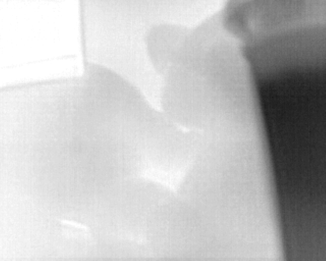
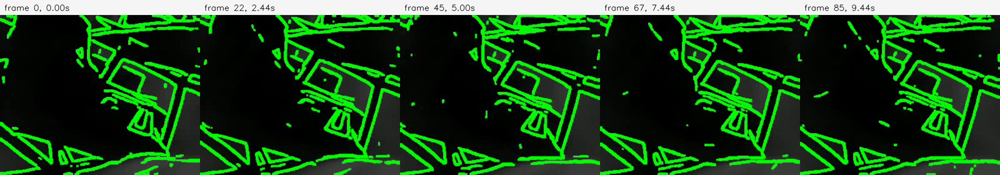
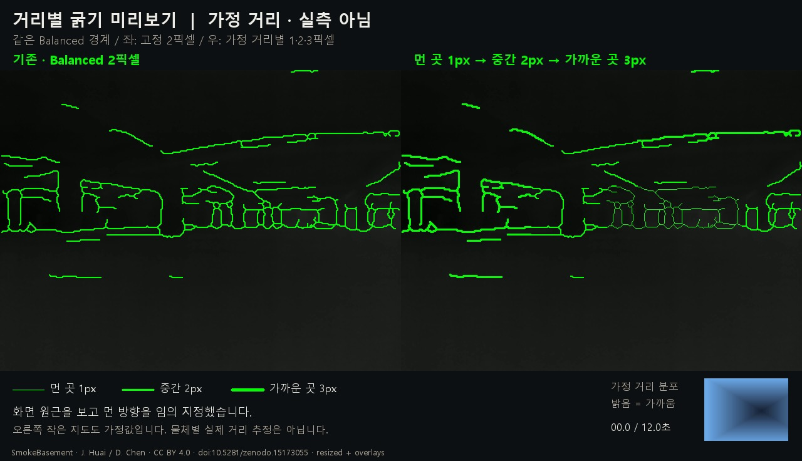

# 1. 입력과 출처

입력이 카메라 원시 신호인지, 색을 입힌 표시 영상인지, 이미 HUD가 합성된 출력인지 구분해야 처리 결과의 의미가 정해진다. 현재 자료에는 이 세 가지와 공개 실측 데이터, 합성 거리/점군이 함께 존재한다.

## 1.1 직접 카메라 탐색 자료

초기 카메라 코드는 `cv2.VideoCapture(0)`으로 첫 영상 장치를 열었다. 장치 모델명·serial·USB VID/PID·radiometric part number·Y16 협상 결과를 기록하지 않는다. 창 제목이 `FLIR Thermal`이고 Boson으로 이름 붙은 별도 영상이 있다는 사실만으로, 모든 자료가 동일 하드웨어·동일 설정에서 나왔다고 확정할 수 없다.

`frame_0.png`부터 `frame_51.png`까지 52장 모두 **640×512, 단일 채널 uint8**이다. 현재 자료에 timestamp·온도 단위·카메라 내참수·distortion·pose는 없다. 번호는 저장 순서일 수 있지만, 시간 간격이 일정한 연속영상이라는 증거가 아니다. 수동 저장 코드에서는 `s` 키를 눌렀을 때만 프레임 번호가 증가한다. [52장 목록과 통계](evidence/frame-inventory.csv)

| 대표 입력 | 최소/최대 표시값 | 평균 표시값 | 목적 |
|---|---:|---:|---|
| [frame_0](evidence/inputs/frame_0.png) | 22 / 255 | 192.576 | 저장 PLY 2개의 계산 입력 검산 |
| [frame_25](evidence/inputs/frame_25.png) | 5 / 255 | 124.257 | 다른 화면 상태의 예 |
| [frame_51](evidence/inputs/frame_51.png) | 0 / 241 | 173.851 | 마지막 저장 프레임의 예 |

255의 존재는 여기서는 8bit 표시값의 최대치다. 센서의 포화 온도나 실제 섭씨 상한으로 해석하지 않는다.

`thermal_test` 디렉터리는 정리 시점에 비어 있었다. 하지만 CloudCompare 스크린샷에는 과거 그 폴더의 `thermal_pointcloud.ply`를 성공적으로 불러온 로그가 보인다. 현재 빈 폴더라는 이유로 과거 실험이 없었다고 결론 내리지 않았고, 현재 남아 있는 같은 이름의 PLY는 별도 자료 폴더에서 확인했다. 스크린샷의 파일이 현재 파일과 bit 단위로 같은지는 당시 hash가 없어 확정할 수 없다.

## 1.2 동영상 3개의 성격

| 원래 이름 | 해상도 / FPS / 길이 | 관찰한 내용 | 사용할 수 없는 주장 |
|---|---|---|---|
| `열화상 카메라 input.mp4` | 1080×1920 / 약 29.973 / 37.4초 | 소형 USB 장치와 `FLIR Thermal` 창을 휴대폰으로 촬영한 현장 기록 | 이 영상 자체가 열화상 센서 원시 출력이라는 주장 |
| `boson_test.mp4` | 320×256 / 9 / 10초, 90프레임 | 어두운 배경에 초록 윤곽선이 이미 합성된 HUD | 원래 열 분포 복원, 새 TEED 확률맵 평가, 온도 측정 |
| `distance_preview.mp4` | 1280×736 / 10 / 12초, 120프레임 | 공개 농연 영상의 같은 Balanced 경계를 고정/가정 거리 폭으로 비교 | 직접 Boson 입력, 실제 거리 추정 결과 |

영상 메타데이터는 [JSON](evidence/video-metadata.json)에 보존했다. 컨테이너 해상도·FPS는 영상의 값이며 센서 사양과 같다고 보장하지 않는다. `distance_preview (1).mp4`는 SHA-256이 같아 중복으로 분류했다.

`distance_preview` 화면에는 “가정 거리 · 실측 아님”, “화면 원근을 보고 먼 방향을 임의 지정”, “물체별 실제 거리 추정은 아닙니다”가 명시되어 있다. 먼 곳 1px → 중간 2px → 가까운 곳 3px로 보이게 만든 초기 **표현 방식 시연**이다. 이 화면의 거리값을 이후 1m→5px/8m→1px 모듈의 실측 입력으로 취급하지 않는다.

## 1.3 농연 실험의 핵심 입력: SmokeBasement

핵심 모델 비교는 직접 보유한 Boson 영상이 아니라 공개 SmokeBasement 열화상 자료를 사용했다. 원 자료 제공자는 소방훈련 연기를 채운 건설현장 지하실에서 2025-01-21에 촬영했다고 설명한다. Zenodo의 공개 메타데이터는 Jianzhu Huai, 2025-04-08 공개, DOI `10.5281/zenodo.15173055`, CC BY 4.0을 확인해 준다. [공식 데이터 기록](https://zenodo.org/records/15173055)

실험 기록은 학습 run3의 중앙 24초에서 32장, 검증 run5의 중앙 12초에서 10fps/120장을 선택했다고 적는다. 검증 120장은 모두 서로 다르며 시간 재표본화 최대 오차는 40.82ms, 학습은 39.40ms다. 서로 다른 run이지만 같은 지하실이므로 새로운 현장 일반화 실험이 아니다. 제공 PNG는 640×512 uint8 3채널이고, 모델에는 320×240로 변환한 표시 영상을 넣었다. [실험 조건](evidence/obstacle-edges/REPORT.md), [저장 집계](evidence/obstacle-edges/results_summary.json)

전체 27GB ZIP 대신 필요한 152개 PNG를 HTTP Range로 추출하고 CRC/SHA-256을 확인했다는 기존 기록이 있다. 이번 아카이브 작업에서 27GB 원 데이터 재다운로드나 152개 모두의 재추출은 수행하지 않았다. 비교 영상에 사용된 12초 원본의 SHA-256은 `3bb826c914c96572ad796664a3e1941dff09803523f63671229f615a546f3aa2`로 여러 후속 실험에서 공통이다.

데이터에는 thermal·LiDAR가 있지만, **이번 선 굵기 실험이 그 LiDAR를 거리 GT로 사용했다는 뜻은 아니다.** 후속 시험의 거리 입력은 별도로 생성한 합성 맵이다. 구간별 연기 농도/가시거리 정답, 동기 RGB, 장애물 boundary 정답은 기록에서 확인되지 않는다.

## 1.4 보조 입력과 합성 입력

Fire360의 IFSI Video 8은 보조 학습, Video 4의 625프레임/약 20.85초는 보조 검증에 사용했다. 이 결과를 농연 강도가 확인된 시험으로 분류하지 않았다. 처음의 RGB sample_3/4 실험 역시 준비 단계로 남겨 핵심 농연 성과와 분리한다. 이 아카이브에는 불필요한 원본 Fire360 동영상 전체를 복제하지 않았다.

합성 자료는 다음과 같다.

- 초기 `firesight_radar_core.py`의 바닥/벽/장애물 점군: 난수 생성, 실제 radar CSV 아님.
- `distance_preview`: 화면 원근에 따른 임의 거리 분포.
- 2026-09-14 굵기 benchmark: sinusoidal 공간·시간 거리, 정지면 Gaussian 노이즈, step/stale/결측 시험.
- 지속 FPS 시험: 위 합성 거리의 TCP 전달. 실제 센서 SDK로 취득한 거리 아님.

이 구분은 합성 시험의 가치를 낮추려는 것이 아니다. 합성값은 정해진 변화·결측 조건에서 표시 동작을 검사하는 데 유용하지만, 센서 정확도는 별도 실측으로 검증해야 한다.

## 1.5 장비 모델과 온도 범위의 미확정 사항

보관된 자료만으로 실제 사용 장치의 정확한 part number와 radiometric 여부를 확인할 수 없다. FLIR 공식 안내는 일반 Boson과 radiometric variant를 구분하며 일반형 출력에서 절대온도를 직접 읽을 수 없다고 설명한다. 따라서 “Boson은 모두 온도를 측정한다”도, “Boson은 모두 비방사형이다”도 이 자료에 붙이지 않는다. 실제 part number와 출력 계약을 확인해야 한다. [FLIR 공식 설명](https://flir.custhelp.com/app/answers/detail/a_id/4148/~/flir-oem---boson-radiometry-%28absolute-temperature-measurement%29)

주변에 있던 FLIR 견적서는 장비 사용 사실을 증명하는 자료가 아니고 거래·연락처 정보가 있어 아카이브에서 제외했다. 촬영 해상도 640×512와 파일명만으로 제품 모델·온도 보정·렌즈 사양을 확정하지 않았다.
