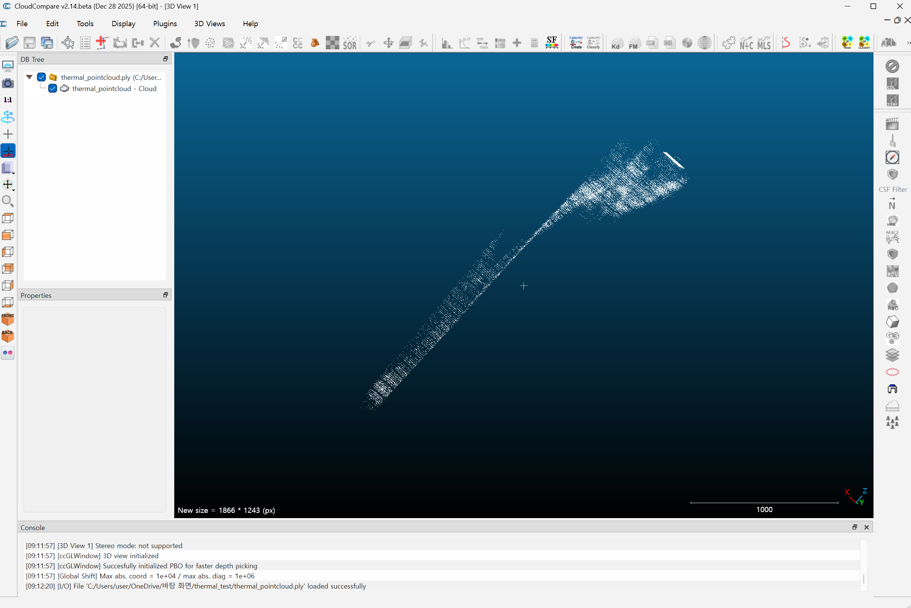
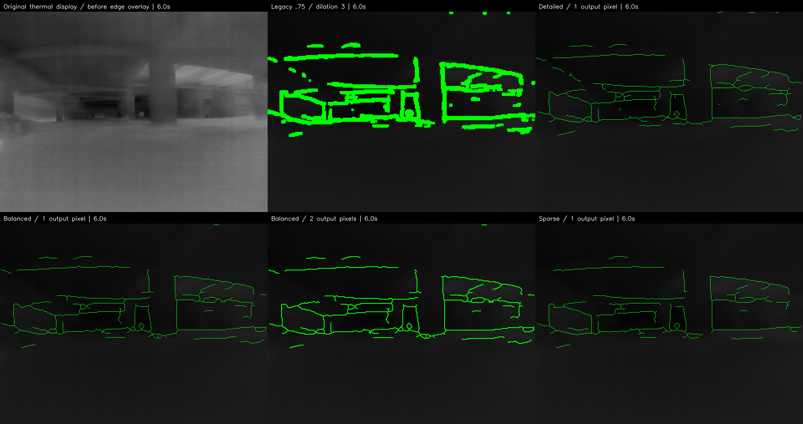
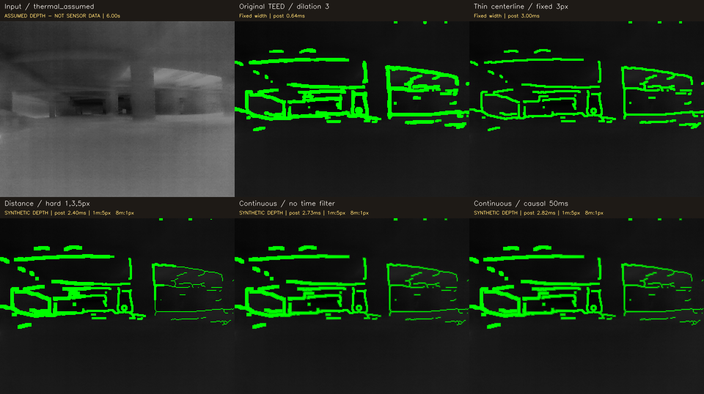

# 3. 결과와 검증

아래 값은 각 실험의 저장 결과를 기준으로 한다. **직접 재검산**은 이번 정리에서 PNG/PLY·파일·동영상을 읽어 확인한 값이며, **기존 실행 기록**은 당시 JSON/CSV/보고서의 값이다. 둘을 구분한다. 모델 추론·파인튜닝·GPU benchmark 전체를 이번 정리에서 재실행하지 않았다.

## 3.1 입력에서 점군까지: 직접 재검산

| 항목 | `thermal_pointcloud.ply` | `thermal_pointcloud_big.ply` |
|---|---:|---:|
| 입력 | `frame_0.png` | `frame_0.png` |
| stride | 4 | 2 |
| 헤더와 실제 vertex 수 | 20,480 | 81,920 |
| 기대 점 수 | 160×128 | 320×256 |
| X 범위 | 0~636 pixel | 0~638 pixel |
| Y 범위 | 0~508 pixel | 0~510 pixel |
| Z 범위 | 305.8824~3000 | 258.8235~3000 |
| `I/255×3000` 최대 절대 오차 | 0 | 0 |
| RGB | 없음 | R=G=B=입력 gray, 전체 일치 |

Z 최소값 차이는 sample 위치가 다르기 때문이다. 더 조밀한 버전이 실제 거리를 더 정확하게 얻은 것이 아니다. 두 파일 전체를 읽어 입력 좌표와 수식을 비교했다. [감사 JSON](evidence/local-audit.json), [작은 PLY](evidence/pointcloud/thermal_pointcloud.ply), [조밀한 PLY](evidence/pointcloud/thermal_pointcloud_big.ply)

위 사진은 PLY가 CloudCompare로 열려 회전·관찰되었다는 근거다. 화면에 등장하는 1000 scale 역시 이 PLY의 임의 좌표 단위이지 실제 1m 보증이 아니다. [다른 시점](evidence/pointcloud/wall-view.png)

### 실행 가능한 원본과 깨진 저장 중간본

초기 원본 `.py` 5개는 Python AST 구문 검사에 통과했다. 현재 카메라 연결이나 Open3D GUI를 다시 실행하지 않았으므로 하드웨어 실행 성공까지 재검증한 것은 아니다. `thermal_image_to_pointcloud.py.save`는 35행, `.save.1`은 1행에서 syntax error가 확인되었다. 두 파일은 실패/편집 중간 흔적으로 따로 보존하고 성공 코드로 소개하지 않는다. 0byte의 `make_data.py`, `Terminal`, `To`, `ZJU`에는 해석할 구현이 없어 공개 핵심 파일에서 제외했다.

## 3.2 2026-09-06 농연 경계 처리 결과: 기존 실행 기록

SmokeBasement run5의 120프레임, 입력 320×240, CPU 4 threads에서 측정했다. 앞 10프레임을 제외한 warm 110개가 시간 집계 대상이다. 전체 처리 시간은 전처리·추론·후처리·렌더링이며 영상 읽기·인코딩·디스크 저장은 제외한다. [저장 JSON](evidence/obstacle-edges/results_summary.json)

| 방식 | 엣지 점유율 | 추론 중앙값 ms | 전체 처리 중앙값 ms | 전체 처리 P95 ms |
|---|---:|---:|---:|---:|
| 기존 TEED | 12.27% | 63.54 | 68.23 | 89.37 |
| 얇은 선 + 밝은 배경 | 2.36% | 59.74 | 69.15 | 85.61 |
| 구조 경계 TEED | 1.51% | 62.30 | 73.54 | 104.55 |
| 의사 라벨 adaptation | 1.45% | 60.44 | 69.49 | 93.68 |
| PiDiNet | 1.94% | 417.90 | 443.93 | 556.90 |

구조 경계의 표시 면적은 12.27%→1.51%로 약 87.7% 줄었다. PiDiNet은 구조 경계 TEED보다 이 CPU의 전체 중앙 처리 시간이 약 6배 길었다. 경계 연속성이 나아 보이는 부분도 있지만 개구부 주변이 닫힌 형태로 연결되는 모습도 관찰되어, 무조건 교체할 근거가 없다는 당시 결론이 적절하다. 정답 경계가 없으므로 false-positive/recall 순위는 계산하지 않았다.

TEED는 58,910개, PiDiNet은 710,149개 파라미터로 기록된다. PiDiNet을 일반 convolution으로 변환한 보조 시험에서도 TEED보다 빠르지 않았다. 이 차이는 특정 CPU·구현·입력 조건의 결과이며 Jetson/TensorRT·메모리 peak·전력의 우열을 말하지 않는다.

### 실제 학습이 있었는가

있었다. 다만 전체 모델 또는 정답 장애물 학습이 아닌 480개 fusion-head 파라미터의 제한적 adaptation이다.

| 기록 | 값 |
|---|---|
| 학습 | 32장, 8 epochs, 256 optimizer steps |
| seed / lr | 20260906 / 1e-4 |
| weighted soft BCE | 0.7557140 → 0.7550460 |
| 변경 tensor | 4개 |
| 준비·학습 시간 | 약 22.78초 |
| checkpoint SHA-256 | `c247138cc65c3a3130fb5237aaa05b08b888879d88109541d7b9b83ff7123a97` |

loss 감소와 저장 weight 기록은 학습 실행 근거다. 감소폭이 작고 시각 차이도 크지 않아, 현장 기본 checkpoint 교체 근거는 부족하다고 정리되었다. 기본 pretrained TEED의 정확도가 더 높다는 정량 비교가 완료된 것도 아니다.

IFSI 보조 평가에서는 기존 TEED 점유율 19.17%, 구조 경계 3.07%, adaptation 2.87%, PiDiNet 2.74%였다. 이 값을 SmokeBasement와 하나의 평균으로 합치지 않는다. 상세 수치와 조건은 [원 보고서](evidence/obstacle-edges/REPORT.md)에 보존했다.

## 3.3 2026-09-08 Boson HUD와 표시 설정

### 이미 합성된 Boson 영상의 선만 추출한 감사

90프레임 HUD에서 초록선 점유율 평균 18.45798%, 세선화된 stroke는 4.03887%였다. 대략 78.1%의 표시 면적 감소다. threshold를 엄격/느슨하게 바꾸면 원래 초록 추출 면적은 17.01515%/18.71516%가 되어 압축색과 추출 규칙의 영향도 드러난다. 원래 thermal 정보나 TEED confidence는 없으므로 이 실험을 검출 개선으로 표현하지 않는다. [audit.json](evidence/boson-review/evidence/audit.json)

### 합성 전 공개 입력을 사용한 동일 확률맵 비교

| 방식 | 출력 640×480의 평균 초록선 점유율 |
|---|---:|
| legacy | 11.4979% |
| detailed / 1px | 1.2701% |
| balanced / 1px | 1.1776% |
| balanced / 2px | 2.6322% |
| sparse / 1px | 1.0272% |

전체 120프레임에서 경계가 전부 비는 frame은 없었다. 이는 개별 얇은 장애물을 하나도 놓치지 않았다는 뜻이 아니다. Balanced 2px는 모니터에서 1px보다 눈에 띄면서 기존보다 배경을 덜 가린다는 정성 판단으로 다음 장비 시연 후보가 되었다. 기본값은 thin/balanced/1px로 남았고 2px는 명시적 옵션이었다.

flow로 직전 경계를 정렬한 평균 residual은 detailed 15.56%, balanced 14.73%, sparse 13.33%, 유효 pair는 119였다. 움직임·가림·새 구조 출현·flow 오차가 포함되므로 순수 깜빡임 비율이 아니다. 선이 적으면 residual도 낮아질 수 있다. 1.3→1.4초와 3.1→3.2초 주변의 연결 변화가 남았다. [검증 JSON](evidence/boson-review/evidence/video_verification_summary.json), [판단 원문](evidence/boson-review/RECOMMENDATION.md)

9월 6일 표의 12.27%와 9월 8일 표의 11.50%는 해상도·표시 계약이 다른 실험이므로 하나의 연속 성능 개선 곡선처럼 비교하지 않는다.

## 3.4 2026-09-14 거리 표시 안정성과 CPU benchmark

모든 방식은 실제 thermal 120프레임의 같은 TEED 확률맵/threshold .75를 공유하지만 **거리 맵은 합성**이다. 입력 320×240, OpenCV/PyTorch 각 2 threads, 모델 예열 5회, 후처리 예열 30회 뒤 방식별 600회 측정했다. [요약](evidence/distance-width/summary.json), [후처리 원자료](evidence/distance-width/benchmark_raw.csv), [공통 TEED 시간](evidence/distance-width/core_metrics.csv)

| 방식 | 후처리 P50 ms | 후처리 P95 ms | TEED 포함 P95 ms | 30fps 처리 예산 초과 |
|---|---:|---:|---:|---:|
| 기존 고정 dilation 3 | 0.449 | 0.941 | 41.443 | 15.0% |
| 중심선 고정 3px | 2.298 | 4.324 | 43.856 | 22.5% |
| 거리 구간식 1·3·5px | 2.590 | 4.788 | 43.899 | 23.3% |
| 연속 폭, filter 없음 | 3.206 | 6.026 | 43.450 | 23.3% |
| 연속 폭, 50ms EMA | 3.285 | 6.216 | 43.583 | 23.3% |

처리 평균 FPS가 약 36.6이라고 해서 모든 frame이 33.333ms 안에 끝난 것은 아니다. 이 CPU 시험은 안정적인 30fps를 확보한 것으로 판정하지 않았다. 별도 CLI 재생에서는 저장 등을 포함한 loop 처리율 27.8fps로 기록되며 위 표와 측정 구간이 다르다.

| 합성 안정성 시험 | 구간식 | 연속 무필터 | 연속+EMA |
|---|---:|---:|---:|
| 4.5m, 거리 noise σ=.18m의 폭 표준편차 | 0 | .1560px | .0864px |
| 구간 경계 3.28m에서 폭 표준편차 | .9963px | .1367px | .0755px |
| 1→8m 완만한 변화의 최대 폭 변화 | 2px/frame | .0251px/frame | .0251px/frame |

구간 중앙에서는 구간식이 0 흔들림일 수 있지만 경계에서는 2px씩 점프한다. 연속 방식은 그 jump를 줄이고 EMA는 작은 noise를 줄였다. 30fps·50ms EMA의 이론적 저주파 지연은 35.2ms이며, 8m→1m 큰 step은 첫 frame에서 5px로 즉시 반영되었다. 이 결과는 **표시 폭 안정성**이며 실제 거리 오차를 줄인 것이 아니다.

## 3.5 지속 30fps 검증: PC GPU에서 확인, 장비에서는 미확인

후속은 Windows PC RTX 5060 Ti, torch 2.11.0+cu128, FP32, 320×240, 각 2 CPU threads, 예열 30회 조건이다. 공개 원본 120frame/10fps를 30fps로 가속 반복하고 합성 거리를 TCP로 전달한다. GPU 완료를 기다린 시각과 `VideoWriter.write`를 포함하되 종료 flush, 창 표시, 센서 노출/driver buffer, 물리 display scanout은 제외한다. [환경](evidence/realtime/environment.json), [전체 조건](evidence/realtime/realtime_results.json)

| 방식 | 측정초 / frame | 평균 FPS | 처리 P99 ms | 호스트 수신→출력 P99 ms | 처리 예산 초과 | 당시 판정 |
|---|---:|---:|---:|---:|---:|---|
| CPU FP32 | 180.003 / 5400 | 29.999 | 33.452 | 34.988 | 1.056% | FAIL |
| CUDA FP32 | 180.008 / 5400 | 29.999 | 11.319 | 12.021 | 0% | PASS |
| CUDA Graph FP32 | 180.021 / 5401 | 30.002 | 10.981 | 11.601 | 0% | PASS |

당시 기준은 180초 이상, 평균≥29.7fps, 각 10초 구간≥29.4fps, 처리 P99≤33.333ms, 예산초과≤1%, 누락≤1%, 수신→출력 P99≤66.667ms, 출력 간격 P99≤50ms와 최대≤100ms, 오류 없음·정상 종료를 함께 요구했다. CPU는 평균이 30에 가까워도 예산 초과율 때문에 FAIL이다. [비교 CSV](evidence/realtime/comparison.csv)

Graph는 eager FP32와 비교해 120frame에서 확률 최대 절대차 `4.76837158e-7`, 이진 경계 불일치 0%, IoU 1로 기록된다. FP16으로 정확도를 낮춰 얻은 속도 결과는 아니다. [출력 동등성](evidence/realtime/quality.json)

이 시험은 “PC의 저장을 포함한 특정 반복 처리 경로가 지속성 기준을 충족했다”는 성과다. 실제 새 카메라 frame 30fps, 센서 동기화, 거리 accuracy, Jetson 속도, 안경 가독성은 검증하지 않았다. 초기 CPU 표와 후속 표는 runner·PyTorch 환경이 다르므로 단순 개선 배수를 계산하지 않는다.

## 3.6 이번 아카이브에서 직접 한 검증

- 원본 52장의 크기·dtype·기본 통계·SHA-256을 조사했다.
- PLY 2개 전체 vertex와 `frame_0` 계산값을 비교했다.
- 원래 전달된 영상 3개와 선별한 비교 영상 4개, 총 7개를 끝까지 디코드하여 프레임 수·FPS·크기를 확인했다. 시간별 대표 frame을 시각 검토했으며, 이는 모든 frame의 개인정보 수동 심사를 뜻하지 않는다. [디코드 감사](evidence/archive-video-decode-audit.json)
- 초기 `.py` 5개와 `.save` 2개를 AST로 구분했다. 카메라와 GUI를 실행하지 않았다.
- 보존한 파일을 SHA-256으로 원본/복사본에 연결했다. 경로 비식별화·문서 링크 정리 등 가공한 파일은 그 사실을 별도 기록한다.

기존 보고서의 테스트 통과·전체 영상 디코드·학습 완료는 당시 기록으로 인용한다. 이번 작업이 동일한 180초 GPU benchmark나 농연 파인튜닝을 다시 완료한 것으로 읽지 않는다.
