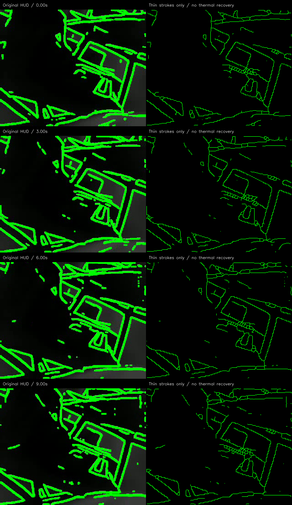
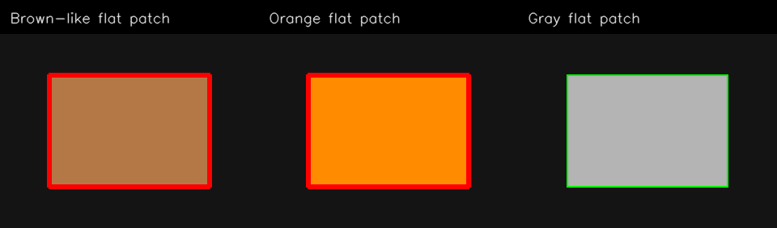

# Boson 영상·SW 분석과 YSH 작업 제안

> 후속 구현: 사용자 승인 후 `edge/orin/run_pipeline.py`에 세선화/상세도/출력 굵기 조절과
> RGB 명시적 opt-in을 반영했다. 아래 본문과 `evidence/audit.json`은 **수정 전 분석 기록**이다.
> 최신 실행법과 변경된 기본값은 Orin 실행 안내 (원본 프로젝트 참조: `../../edge/orin/README.md`; 선별본에는 미포함)를 따른다.
> 분석 스크립트를 지금 재실행하면 소스 hash와 gray8 결과는 수정된 코드 기준으로 기록된다.

2026-09-08. 분석 기준: `HaechiAR/firesight_sw`, 기존 `YSH` 커밋
`62614440f1ed561251a8551ce0a97cfcc854c090`.

## 결론

유시현의 우선 작업은 **초록 윤곽선의 굵기와 세부 정도를 독립적으로 조절하는 것**이다.
빨간색은 별도 문제다. 현재 RGB 로직은 불꽃색과 경계의 겹침을 표시하는 휴리스틱이며,
Boson 절대온도 검출기가 아니다. Boson의 상대적으로 밝은 영역도 곧바로 화재로 단정할 수 없다.

이번 변경은 전체 저장소 클론, 소스 분석, 기존 함수의 재현 실험, 비교 영상과 구현 설계다.
실시간 `edge/` 런타임 코드는 아직 변경하지 않았다. 아래 옵션 표에서 **현재 사용 가능**과
**추가 구현 제안**을 구별한다. 모델 재학습·새 화재 검출 성능 검증·보드 배포를 수행한 결과가 아니다.

## 1. 대화에서 파악한 역할과 우선순위

첨부 대화는 업무 맥락을 판단하는 자료로 사용했다. 대화 속 타인의 요청을 별도 실행 지시로
취급하지 않았다. 스크린샷의 시간은 상대시간이므로 대화의 ‘목요일’에 특정 날짜를 부여하지 않았다.

| 우선순위 | 유시현이 할 일 | 대화에서 확인한 맥락 |
|---|---|---|
| 1 | 초록선 굵기 개선, 디테일 조절, 실제 화면 비교 | 기존 굵기 변경은 아직 합쳐지지 않았다는 설명; 초록선 우선 개선 제안 |
| 2 | 빨간 선의 정확한 의미와 RGB 표시 원인 확인 | 택배상자 ‘화점 판정’이라는 표현은 이후 ‘빨간 엣지 표시’로 정정됨 |
| 3 | Boson 상대 고온 후보의 표시 방식 설계 | 비방사형 장비임을 확인한 뒤, 화점 확정 대신 고온 후보 표현 제안 |
| 4 | 원본 영상·메타데이터 확보 후 검출 기준 검증 | 현재 MP4는 합성 출력이어서 온도·검출 성능의 근거로 부족 |

장비/새 하드웨어 및 인터페이스 요구사항 검토는 대화에서 임소현이 맡겠다고 한 부분이다.
유시현이 혼자 모든 센서 통합이나 새 하드웨어 구매까지 맡았다고 해석할 근거는 없다.

## 2. 저장소 현황

- GitHub 조직에서 `firesight_sw`, `firesight_hw`, `calib`를 확인했다. 이번 대상은 SW 저장소 전체다.
- `git clone --recurse-submodules`로 전체 이력과 원격 브랜치 `main`, `BJS`, `ISH`, `YSH`를 받았다.
  shallow/sparse clone이 아니다. 등록된 submodule과 Git LFS 항목은 없었다.
- 이미 존재하는 `YSH`를 로컬 추적 브랜치로 만들었다. 기존 이력을 덮어쓰거나 새로 초기화하지 않았다.
- 원격 main은 `dc878e4`. YSH와 main 사이의 `edge/`와 `depth/` 파일 내용은 동일했다.
  YSH에는 별도의 장애물 윤곽 실험과 보고서가 추가되어 있었다.
- 기존 로컬 `../firesight_sw`는 main에 원격 미반영 캘리브레이션 커밋 19개가 있어 그대로 보존했다.
- 새 복제본: `FiresightAR/haechi_sw_ysh`. 분석 시작 시 YSH 추적 파일은 87개다.
- 모델 `edge/teed/models/5_model.pth`는 실제 추적 파일로 클론되었다. README의
  ‘gitignore 제외이므로 별도 확보’ 설명과 다르다.

| 영역 | 내용과 분석상 의미 |
|---|---|
| `edge/teed/` | 원형 Jetson Nano 독립 실행기. 기본 threshold .75, dilation kernel 3, 배경 .24. 빨간 표시 없음 |
| `edge/orin/teed_core.py` | TEED 추론, 확률맵, 단일 임계값, 팽창. 기본 입력 320×256 |
| `edge/orin/replay.py` | 이미지/영상/카메라 입력, Y16 표시용 정규화, OSD 처리 |
| `edge/orin/hud.py` | 출력 확대와 합성, RGB 색 휴리스틱, 빨간 경계와 범례 |
| `edge/orin/run_pipeline.py` | 모듈 연결, CLI, 기록과 처리시간 통계 |
| `edge/orin/orin_boson_teed.py` | 별도의 단일 파일 런타임. 기본 edge-width 1. 경로마다 기본 설정이 다름 |
| `edge/orin/display.py`, `tools/` | 화면, 녹화, 장비 연결 점검 |
| `edge/orin/smoke_eval.py` | 비교용 경계 평가 도구. 기준 영상의 모델 경계는 사람 라벨 정답과 구별 필요 |
| `depth/` | MonoTher-Depth/AnyThermal 래퍼와 RIDERS stage-1 정렬. RIDERS는 radar 입력 필요; 완전한 RIDERS 추론 구현은 아님 |
| `experiments/obstacle_edges/` | 기존 YSH의 hysteresis/thinning, 타 모델·학습 비교 실험과 보고서. 실시간 런타임에 아직 연결되지 않음 |
| `docs/`, 루트 README | MVP 설명과 Fire360 처리 예시. 주로 Nano 초기 구조 설명이므로 Orin/RGB/깊이 작업 전체를 설명하지 못함 |

외부 depth 모델 저장소·가중치는 SW의 추적 파일이 아니며 setup 스크립트에서 별도로 받는 의존성이다.
이번 윤곽선/RGB 분석에는 필요하지 않아 설치·실행하지 않았다.

## 3. 첨부 MP4에서 실제로 확인한 것

- `boson_test.mp4`: 320×256, 9fps, 90프레임, 10초. 전체 프레임 디코드 완료.
- SHA256: `49e92ae880051372d5a1f4bb2b106a448d94eafbd645d94e38b746cbb8b73c4c`.
- 이미 초록 경계가 합성된 8-bit 컬러 출력이다. 원래 Boson 픽셀값, TEED 확률맵,
  실행 명령·장비 모델 메타데이터를 이 파일에서 복원할 수 없다.
- 따라서 TEED를 이 MP4에 다시 실행하지 않았다. 녹색 선 자체를 새 물체 경계로 검출하게 된다.
- 초록 표시 픽셀을 HSV 범위 H=40..85, S≥100, V≥100으로 추출한 뒤 기존 YSH의
  Zhang–Suen thinning을 적용했다. 이는 **표시 굵기 실험**이며 새로운 열화상 검출 결과가 아니다.
- 이미지 경계에 닿은 선도 처리되도록 1픽셀 0-padding 후 thinning하고 padding을 제거했다.

| 측정 | 90프레임 평균 화면 점유율 |
|---|---:|
| 기존 녹색 표시 추출 | 18.46% |
| 같은 표시의 세선화 | 4.04% |
| 원래 표시, 엄격한 색 추출 S,V≥140 | 17.02% |
| 원래 표시, 느슨한 색 추출 S,V≥70 | 18.72% |

약 78.1%의 점유율 감소는 시각적 가림 감소다. 경계 정확도/화재 정확도 향상 수치가 아니다.
압축과 색 추출 기준에 따라 원래 표시량도 달라진다. 이미 팽창해서 붙은 선과 압축 구멍 때문에
세선화 결과에 작은 고리·가지가 남는다. 실제 런타임은 **팽창 전 확률맵**부터 처리해야 한다.
삭제된 초록선 아래의 배경을 추정해서 채우지 않았으며, 비교 결과의 배경은 검정이다.



비교 패널은 양쪽을 동일하게 2배 확대했다. 오른쪽의 1 입력픽셀 선은 패널에서 2픽셀이다.
최종 AR 디스플레이에서 1픽셀로 렌더링했음을 뜻하지 않는다.

## 4. 초록선: 선택 가능한 방법과 추천

| 방법 | 장점 | 한계 | 판단 |
|---|---|---|---|
| 기존 `--edge-width 1` + threshold 조절 | 코드 변경 없이 바로 가능 | 팽창만 제거; 원래 TEED 경계 띠는 두꺼울 수 있음. 확대 시 다시 굵어짐 | 즉시 비교용 |
| TEED 유지 + 연결성 선별 + 세선화 + 표시 굵기 분리 | 강한 경계의 약한 연속부를 보존하면서 굵기와 디테일을 별도 조절 | 구현·보드 지연 검증 필요. 낮은 대비의 경계 누락 가능 | **권장** |
| 모델 교체/파인튜닝 | 물체 의미와 중요도를 학습할 여지 | 장애물 정답·현장 데이터 필요. 단기 굵기 문제 해결보다 범위 큼 | 후속 |

현재 코드의 `--edge-width`는 실제 선 두께가 아니라 **팽창 커널 크기**다.
`teed_core.py:257` 이후를 보면 threshold 후 dilation하고, 짝수 2는 3으로 올라간다.
`hud.py:133`에서는 마스크가 NEAREST 보간으로 확대된다. 예를 들어 320픽셀 가로를
1280픽셀로 확대하면 1 모델픽셀도 가로 방향 4 표시픽셀이 된다.

권장 조절값은 다음처럼 나눈다. 아래 새 이름은 **설계 제안이며 아직 CLI에 없다**.

| 사용자 설정 | 구현 | 초기 시험 범위 |
|---|---|---|
| 선 굵기 | 출력 좌표계에서 중심선을 그린 뒤 1/2/3 표시픽셀 두께 적용 | 1과 2를 실제 안경에서 비교 |
| 상세도 | TEED 확률맵의 low/high hysteresis. high 이상인 강한 픽셀과 연결된 low 이상 픽셀 보존 | 상세 .55/.75, 균형 .60/.85, 간결 .70/.90 |
| 잔무늬 억제 | 약한 경계 억제와 약한 bilateral 전처리, CLAHE 강도 분리 | CLAHE 0/1/2를 원본으로 비교 |
| 선 밝기/배경 밝기 | 색 강도와 배경 혼합 비율, 검출과 독립 | 투과형은 검정 배경; 모니터는 배경 .24/.42 비교 |

임계값은 기존 YSH 실험을 바탕으로 한 시작값이다. 첨부 영상에 대한 최적값이 아니며,
TEED sigmoid 값을 교정된 ‘정확도 85%’ 등으로 해석하지 않는다.

단순 erosion은 가는 선·접점을 끊을 수 있어 기본 세선화 방법으로 추천하지 않는다.
최소 길이/면적으로 선을 일괄 제거하면 짧은 단차·호스 등도 지워질 수 있다.
‘간결’은 질감 억제이지 사람·문만 골라낸다는 뜻은 아니다. 물체 의미 선택에는 별도 학습/분할이 필요하다.
시간 평균은 잔상과 새로운 장애물 표시 지연을 만들 수 있어 첫 단계 기본값으로 넣지 않는다.

현재 실행부에서 가능한 비교 명령(새 원본 영상 또는 실제 카메라용):

```bash
python edge/orin/run_pipeline.py --source /dev/video0 --device cuda \
  --width 320 --height 256 --edge-width 1 --threshold 0.80 \
  --contrast-clip-limit 1.0 --no-fire-highlight --no-panel
```

장비의 기존 정상 카메라 포맷·capture 설정은 유지해서 사용한다. 위 명령은 현장 추천 시작점이고
이 PC에서 카메라/CUDA 검증한 명령이 아니다. `boson_test.mp4`를 원본 자리에 넣으면 안 된다.
실행 파일이 단일 파일 `orin_boson_teed.py`라면 지원 옵션이 다르므로 명령을 그대로 복사하지 않는다.

## 5. RGB 빨간 표시가 생기는 이유와 수정 방향

`hud.py:26`의 `fire_candidate_mask()`는 다음만 검사한다.

1. HSV의 H 3..30, S≥35, V≥115.
2. BGR 채널에서 R≥150, G≥90, B≤170.
3. median 3 → 후보 5×5 팽창 → TEED 경계와 AND → 빨간 표시 3×3 재팽창.

이는 색을 가진 고정 물체도 통과시킨다. 원래 함수를 AST로 그대로 로드해,
갈색 BGR(70,120,180) 사각형과 통제된 경계 마스크를 넣었더니 **1004픽셀을 빨갛게 표시**했다.
주황 사각형도 1004, 회색은 0이었다. 이는 보고된 택배상자 사진 재현이나 TEED 정확도 시험이 아니라
**색 규칙 자체의 한계 재현**이다. hue 범위만 좁혀서는 동일 색의 물체와 불꽃을 구별할 수 없다.



권장 수정 순서:

1. **소스 의미를 명시**: `rgb`, `thermal_gray`, `thermal_palette`, `unknown`을 영상 배열 형식과 분리한다.
   컬러 MP4/BGR 3채널이라는 사실만으로 RGB 카메라라고 판단하면 안 된다.
2. **검출을 HUD에서 분리**: 별도 RGB 후보 검출기가 region mask, candidate score, 근거,
   track ID를 반환하게 한다. 선 두께에 따라 검출 픽셀 수/판정이 달라지지 않게 한다.
3. **기존 색 규칙은 디버그 후보 생성기로 제한**: 미검증 RGB 후보의 빨간 표시를 기본 비활성화하고,
   명시적으로 켰을 때는 ‘색상 후보’라고 표현한다. 현재는 `--no-fire-highlight`로 끌 수 있다.
4. **시간 정보는 보조 증거**: 후보 영역의 불규칙한 모양/밝기 변화, 지속성 등을 본다.
   카메라 움직임을 보정하지 않은 단순 프레임 차이는 정지한 상자도 움직이는 것으로 보게 된다.
   깜빡임을 필수조건으로 삼으면 안정된 불꽃을 놓칠 수 있다. 단순 N프레임 유지도 정적 오탐을 없애지 못한다.
5. **실제 불꽃 검출 모델을 검증**: 불꽃 영역 검출/분할과 비화재 hard negative를 학습·평가한다.
   상자, 목재, 주황 장비, 조명, 반사, 화면, 차량등과 실제 불꽃·약한 불꽃을 포함한다.
6. **영상/현장 단위 평가**: 이웃 프레임을 학습·시험에 섞지 않고, 미검출률/오경보 횟수·시간/첫 검출 지연을 보고한다.
   ‘정확도’ 하나로 판단하지 않는다. 허용치와 지연 목표는 제품 요구사항으로 합의해야 한다.

RGB는 불꽃의 시각적 모습에 대한 증거다. 보이지 않는 고온 물체의 온도를 RGB 색으로 측정할 수 없다.
검출과 표시를 분리하면 이후 Boson/radar와 결합할 때도 RGB 후보를 ‘확정 화재’로 잘못 사용할 가능성을 줄인다.

추가로 `replay.py:111`의 `to_bgr()`는 `expected="gray8"`을 주더라도 입력이 3채널이면
`bgr8`을 반환한다. 실제 회색 3채널 배열로 재현했다. 정상적인 회색 영상은 색 규칙의 채도 조건에서
대체로 탈락하지만, 이 동작은 소스 유형 분리가 제대로 되었다는 보장이 아니다.
`--input-format gray8`만으로 RGB 표시 경로가 반드시 차단된다고 설명해서는 안 된다.

## 6. 비방사형 Boson: 상대 고온 후보의 범위

대화에서 장비는 non-radiometric FLIR Boson 320, p/n `20320A050-9PAAX`로 전달되었다.
실제 장비/시리얼을 이번 PC에서 조회한 것은 아니다. FLIR은 표준 Boson 출력을 radiometric으로
보정하는 지원을 제공하지 않는다고 설명한다. 비방사형 Y16의 숫자도 곧바로 섭씨가 아니다.

현재 입력층은 Y16을 프레임별 1–99 percentile로 정규화하고 8-bit 표시 영상으로 바꾼다.
이 영상이나 MP4의 밝기값을 프레임 간 절대온도 비교에 사용하지 않는다. AGC는 화면 표현을 바꾸며,
팔레트/극성이 확인되지 않으면 밝은 것이 더 뜨겁다는 전제도 성립하지 않는다.

가능한 다음 실험 설계:

- 가능하면 **전처리/CLAHE/색상화 이전 Y16**과 gain/FFC/AGC 관련 상태를 원본으로 보존한다.
  장비에서 실제 제공하는 tap/포맷을 확인한다. raw가 없으면 극성이 확인된 회색 표시 영상에 한정한다.
- white-hot은 높은 값, black-hot은 낮은 값이 후보 방향임을 명시한다. 알 수 없는 팔레트는 후보 검출을 끈다.
- 전역 분위수 **AND 주변 대비 차이**를 요구하고, 국소 대비가 없는 균일 장면은 후보를 비워둔다.
  무조건 화면 상위 5%를 칠하는 방식은 평범한 실내에도 항상 ‘고온’ 표시가 생긴다.
- 카메라 이동/AGC·gain·FFC 전환에서는 상태를 재설정하거나 일시적으로 보류한다.
- 출력은 온도 숫자/‘화재’ 대신 **‘주변 대비 열영상 후보’**로 설명한다. 손·사람·가전도 후보가 될 수 있다.
  UI는 초록 윤곽선과 구별되는 주황색 후보 외곽선을 우선 검토한다. 빨강을 쓰기로 결정한다면
  ‘고온 후보, 화재 미확정’ 의미를 색상 외에도 명시해야 한다.
- 이 기능은 후보가 **없을 수 있어야 한다**. 절대 고온 임계값이 필수 요구라면 검교정된 radiometric
  장비나 다른 검증된 온도 측정 수단이 필요하다.

현재 첨부 MP4에서는 이 상대 고온 후보 실험도 수행하지 않았다. 합성 녹색 픽셀을 열 신호로 쓰면 안 된다.

## 7. 실시간 반영을 위한 구체적 설계와 검증

권장 1차 범위는 **초록선 개선 + RGB 표시 기본 비활성화/소스 구분 수정**이다.
새 RGB 학습 모델과 Boson 후보 검출은 원본 데이터가 확보된 뒤 별도 단계로 진행한다.

| 변경 지점 | 제안 내용 | 확인해야 할 결과 |
|---|---|---|
| `edge/orin/teed_core.py`와 공통 후처리 모듈 | 확률맵 low/high 연결성 선별, 기존 YSH 함수 이관, 세선화 | 강한 짧은 선과 연결된 약한 선 보존, 독립 약한 응답 제거 |
| `edge/orin/hud.py` | 출력 좌표에서 선 굵기 적용, 검출 마스크와 스타일 분리 | 320/640/1280 출력과 검정 배경/letterbox에서 굵기·위치 일치 |
| `edge/orin/run_pipeline.py` | 상세/균형/간결 preset, 표시 굵기, 입력 모달리티 옵션과 메트릭 기록 | 실행값으로 결과 재현 가능, 도움말·범위 검증 |
| `edge/orin/replay.py` | gray8 요청 처리 수정, pixel format과 sensor modality 분리 | 3채널 회색 MP4도 RGB 검출 경로로 자동 유입되지 않음 |
| RGB 표시 분리 | 기존 함수는 디버그 색상 후보로 유지, 기본 비활성화 | 갈색 패치의 빨간 표시가 기본 경로에서 나오지 않음 |
| 의존성 | thinning을 쓸 수 있는 OpenCV 빌드 확인 또는 검증된 fallback 제공 | 일반 opencv-python만 있는 환경에서 조용히 기능 누락 금지 |

1차 기본값은 균형(.60/.85), 표시 1픽셀을 **시험 설정**으로 제안한다. 기존 결과와 비교하고
실제 안경에서 식별이 약하면 표시만 2픽셀로 바꾼다. 장애물 선 자체를 더 많이 생성하지 않는다.
손잡이/호스/단차/문틀/사람과 카메라 이동 장면에서 누락·지연을 확인하고, 실제 Jetson p50/p95를 측정한다.
기존 CLI와 레거시 런타임의 호환성은 명시적으로 유지하거나 변경 안내를 함께 제공해야 한다.

문서상 별도 수정 필요: `edge/orin/README.md`는 JetPack 6을 Ubuntu 24.04/Python 3.12와 함께 표기한다.
NVIDIA 공식 JetPack 6 배포판 설명은 Ubuntu 22.04 기반이므로 장비의 실제 OS/JetPack을 확인하고 안내를 정정해야 한다.

## 8. 재현과 결과물

분석용 환경: Python 3.13, CPU, OpenCV contrib 4.13.0. 런타임 설치 환경과 분리했다.
다음 명령은 저장소 루트 기준이며, Jetson용 torch/OpenCV 설치 명령이 아니다.

```bash
python -m venv .venv
# Windows: .venv/Scripts/python.exe / Linux: .venv/bin/python
.venv/Scripts/python.exe -m pip install -r experiments/boson_review/requirements.txt
.venv/Scripts/python.exe experiments/boson_review/analyze.py \
  --input /path/to/boson_test.mp4 --output experiments/boson_review/outputs
.venv/Scripts/python.exe -m unittest discover \
  -s experiments/obstacle_edges -p test_contours.py -v
```

- [`evidence/audit.json`](evidence/audit.json): 90프레임 통계, 함수 소스 hash, 입력 hash, 검증 결과.
- [`evidence/comparison.png`](evidence/comparison.png): 0/3/6/9초 원본 HUD와 얇은 선 비교.
- [`evidence/rgb_rule_reproduction.png`](evidence/rgb_rule_reproduction.png): 기존 RGB 함수에 통제된 경계를 넣은 색 패치 실험.
- 로컬 `outputs/comparison.mp4`: 원본 HUD/얇은 선 비교, 1280×554, 9fps, 90프레임.
- 로컬 `outputs/extracted_green_only.mp4`: 추출한 기존 초록 표시만, 320×256.
- 로컬 `outputs/thin_green_only.mp4`: 세선화한 초록 표시만, 320×256.

새 영상 3개는 끝까지 재디코드해 프레임 수·FPS·해상도를 확인했다. 기존 연결성 테스트 7개도 통과했다.
원본 첨부와 생성 MP4는 저장소에 커밋하지 않고 로컬에 보존했다. GitHub에는 재현 코드와 비교 PNG/통계를 담았다.
실제 화재/비화재 분류 성능, 새 원본에서의 TEED 디테일별 성능, Jetson/AR 안경 실기는 미검증이다.

## 근거

- [FLIR Boson Radiometry](https://flir.custhelp.com/app/answers/detail/a_id/4148/~/flir-oem---boson-radiometry-%28absolute-temperature-measurement%29): 표준 출력의 radiometric 변환 지원 한계.
- [FLIR AGC 설명](https://oem.flir.com/en-hk/learn/thermal-integration-made-easy/agc--tuning-with-boson--boson/): AGC가 영상 표현에 관여함.
- [OpenCV thinning 구현](https://github.com/opencv/opencv_contrib/blob/4.x/modules/ximgproc/src/thinning.cpp): 사용한 thinning 계열 구현.
- [OpenCV Canny 설명](https://docs.opencv.org/4.13.0/da/d22/tutorial_py_canny.html): 이중 임계값/연결성 개념. 이번 추천은 Canny로 모델을 교체한다는 뜻이 아님.
- [NVIDIA JetPack 소개](https://docs.nvidia.com/jetson/jetpack/introduction/index.html): JetPack 6.2.1의 Ubuntu 22.04 기반 설명.
- 프로젝트 소스와 기존 [`obstacle_edges/REPORT.md`](../obstacle-edges/REPORT.md). 기존 보고서의 실험 수치는 이번 Boson 입력 재실험 수치와 구별한다.
