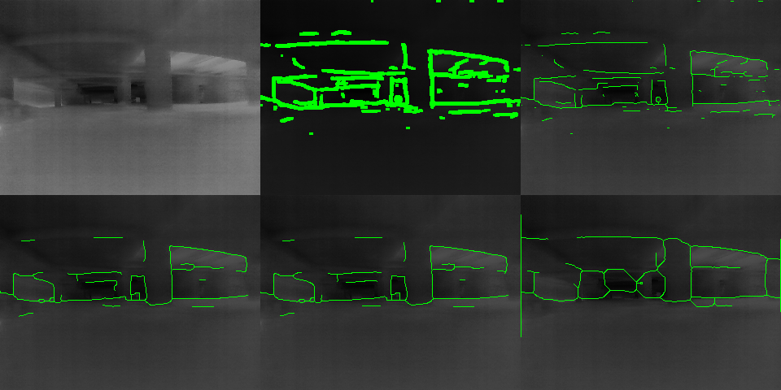

# 농연 열화상 장애물 윤곽 실험 결과

파일별 이름·내용·처리 방식은 [결과물 파일 안내](ARTIFACT_GUIDE.md)를 참고한다.

2026-09-06 · `YSH` · CPU 로컬 실행 · 실제 가중치 학습/영상 저장 수행

## 판단

**우선 TEED를 유지하고, 3픽셀 팽창을 없애고 구조 경계를 선별하는 후처리를
적용하는 것이 낫다.** 기둥·벽의 윤곽을 보려는 목적에 비해 현재 출력은 굵은 선이
차지하는 면적이 크다. 이번 농연 샘플에서 구조 경계 방식은 화면 엣지 점유율을
12.27% → 1.51%로 줄였다
(상대 87.7% 감소). 이것은 **표시 밀도 감소**이며 장애물 정확도 향상 수치가 아니다.

의사 라벨 파인튜닝도 실제 실행했지만 후처리만 바꾼 결과와 시각적인 차이가 작다.
현장 기본 모델을 이 체크포인트로 교체할 근거는 부족하다. 본격 학습에는
장애물 외곽·단차·통행 공간의 정답 라벨이 필요하다.

PiDiNet은 윤곽을 더 연속적으로 잇는 장면이 있었으나, 검토 프레임에서는 어두운
개구부 주변을 닫힌 도형처럼 연결하는 선도 보여 추가 검증이 필요했다. 같은 CPU의
전체 처리 중앙값은 구조 경계 TEED의 약 6.0배다. 전면 교체는 추천하지 않는다.
정량적인 false-positive 판정은 정답 경계가 없어 수행하지 않았다.

## 실제 농연 조건과 데이터

핵심 실험은 [SmokeBasement 원 출처](https://zenodo.org/records/15173055),
DOI `10.5281/zenodo.15173055`의 실제 열화상 PNG를 사용했다. 저자는 건설현장
지하실을 소방 훈련용 연기로 채워 촬영했다고 명시한다. 함께 제공된 현장 사진에서도
주변 구조가 연기로 흐려진 상태를 확인했다. RGB에 연기나 열화상 효과를 합성하지 않았다.

- 학습: run3 중앙 24초 구간에서 서로 다른 32장.
- 검증: run5 중앙 12초 구간, 최근접 시각 선택으로 10fps/120장의 영상을 구성.
- 시간 재표본화 최대 오차: 학습 39.40ms,
  검증 40.82ms. 검증 프레임 120장은 모두 서로 다르다.
- 서로 다른 주행이지만 같은 지하실이다. 독립 현장 일반화 시험이 아니다.
- 원본 제공 PNG는 640×512, uint8, 3채널이며 온도값/16-bit 센서 raw로 해석하지 않았다.
- 구간별 연기 농도·가시거리와 동기화된 RGB 영상은 없다. 현장 사진은 환경 근거이고,
  특정 열화상 프레임과 동기화된 RGB 비교 정답은 아니다.
- 전체 27GB를 받지 않고 필요한 152개 PNG를 HTTP Range로 추출하여 ZIP CRC와
  SHA256로 검증했다. 전체 파일명·시각·hash는 `data/smoke_manifest.json`에 남겼다.

보조 열화상 실험은 Fire360의 IFSI Video 8에서 학습하고 IFSI Video 4 전체
625프레임/약 20.85초에서 검증했다. IFSI는 농연 강도가 확인된 평가로 분류하지 않았다.
초기 RGB sample_3/4 실험은 준비 단계 보조 자료이며 핵심 결론의 농연 근거로 쓰지 않았다.

## 무엇을 바꿨나

| 방식 | 처리 |
|---|---|
| 현재 TEED | CLAHE 2.0 → TEED → .75 threshold → 3px dilation → 배경 .24 |
| 얇은 선 + 밝은 배경 | 같은 TEED 입력/threshold → skeletonization → 배경 .55 |
| 구조 경계 | bilateral(5,25,3), CLAHE 없음 → TEED → .60/.85 hysteresis → skeletonization → 배경 .55 |
| 파인튜닝 | fusion-head 가중치만 적응 후 구조 경계와 동일 후처리 |
| PiDiNet | 공식 table5 checkpoint/RGB 정규화 → .20/.40 hysteresis → skeletonization → 배경 .55 |

hysteresis는 강한 경계에 이어지는 약한 경계는 살리고, 독립적인 약한 응답은
버린다. 짧다는 이유만으로 강한 경계를 제거하지 않는다. 낮은 대비의 진짜 장애물이
삭제될 가능성은 여전히 남아 정답 라벨 검증이 필요하다. 신규 장애물 출현을 늦출 수
있는 시간 평균은 표시 영상에 사용하지 않았다. depth 추론은 수행하지 않았다.

`thin_only`는 코드 키이며 배경 밝기도 바꾸므로 선 두께만의 순수 영상 ablation이
아니다. 저장한 boolean 마스크로 렌더링 효과를 분리할 수 있다. 각 모델 threshold는
정답 라벨로 교정한 동일 precision/recall 지점이 아니므로 모델 정확도 순위로 읽지 않는다.

영상에는 새 패널, 물체명, 박스, 자막, 성능 숫자를 넣지 않았다. SmokeBasement에는
원본 숫자/로고도 없다. IFSI에 원래 있던 OSD는 배경에 남고 기존 프로파일대로 엣지만
제외했다. 별도로 배경 없는 순수 초록 엣지 영상도 저장했다.

## 농연 구간 실측

Intel Core Ultra 7 258V, Windows 11, CPU 4 threads, 320×240, PyTorch 2.14.0+cpu.
앞 10프레임을 제외한 warm 값이다. 전체 처리는 전처리/추론/후처리/렌더링이며,
영상 읽기·인코딩·디스크 저장은 제외한다. 영상 10fps 재생은 실시간 10fps 처리의
증거가 아니다. CPU 측정이며 Jetson/Intel GPU/TensorRT/전력 검증을 하지 않았다.

| 방식 | 엣지 점유율 | 추론 중앙값 | 전체 처리 중앙값 | 전체 처리 p95 |
|---|---:|---:|---:|---:|
| 현재 TEED | 12.27% | 63.54 ms | 68.23 ms | 89.37 ms |
| 얇은 선 + 밝은 배경 | 2.36% | 59.74 ms | 69.15 ms | 85.61 ms |
| TEED 구조 경계 후처리 | 1.51% | 62.30 ms | 73.54 ms | 104.55 ms |
| TEED 의사 라벨 파인튜닝 | 1.45% | 60.44 ms | 69.49 ms | 93.68 ms |
| PiDiNet | 1.94% | 417.90 ms | 443.93 ms | 556.90 ms |

TEED는 58,910 parameters, PiDiNet은 710,149 parameters.
원 체크포인트는 각각 249,139 bytes / 2,871,148 bytes다. 프로세스별 peak RAM과 전력은
측정하지 않았으므로 모든 자원 측면의 우월성을 주장하지 않는다.

공식 PiDiNet의 일반 CNN 변환도 IFSI Video 4의 세 프레임에서 추가로 확인했다. 원 모델 대비 최대
출력 오차는 3.1e-06였고, 별도 warm forward
중앙값은 원 구현 394.25ms,
변환 구현 383.94ms,
TEED 60.56ms였다. 이 CPU에서는 변환 후에도
TEED보다 빨라지지 않았다. 저장 영상은 원 PiDiNet 구현으로 처리했다.

## 실제 파인튜닝 기록

- seed 20260906, 학습 32장, 8 epochs × 32 = 256 optimizer steps, Adam lr 1e-4.
- TEED feature extractor는 고정하고 `block_cat`의 480개 파라미터만 학습.
- 같은 TEED의 320×240/160×120 응답으로 의사 라벨 구성: 작은 스케일에서 유지되지
  않는 세부 응답을 줄이되 매우 강한 원 응답은 일정 비율 보존.
- weighted soft BCE: 0.75571400 → 0.75504595.
- 학습 및 의사 라벨/feature 준비 시간: 22.78초. 실제 변경된 tensor 4개.
- 가중치: `outputs/smoke/teed_fusion_adapted.pth`.
- SHA256: `c247138cc65c3a3130fb5237aaa05b08b888879d88109541d7b9b83ff7123a97`.

이는 의사 라벨을 이용한 제한적 adaptation이다. 정답 장애물 라벨로 supervised
fine-tuning한 결과가 아니다. 자기 응답을 교사로 쓰므로 새로운 회피 의미를 가르치는 데
한계가 있으며, 작은 loss 감소를 회피 성능 향상으로 해석하지 않는다.

## 영상과 대표 프레임

- 농연 원본 (원본 프로젝트 참조: `outputs/smoke/smoke_heldout_original.mp4`; 선별본에는 미포함)
- 현재 후처리 (원본 프로젝트 참조: `outputs/smoke/smoke_heldout_baseline.mp4`; 선별본에는 미포함)
- 권장 우선안: 구조 경계 TEED (원본 프로젝트 참조: `outputs/smoke/smoke_heldout_structural.mp4`; 선별본에는 미포함)
- 의사 라벨 파인튜닝 (원본 프로젝트 참조: `outputs/smoke/smoke_heldout_adapted.mp4`; 선별본에는 미포함)
- PiDiNet 비교 (원본 프로젝트 참조: `outputs/smoke/smoke_heldout_pidinet.mp4`; 선별본에는 미포함)
- 배경 없는 엣지만 (원본 프로젝트 참조: `outputs/smoke/smoke_heldout_edges_only.mp4`; 선별본에는 미포함)

아래 비교 이미지: 위 행은 원본 / 현재 / 얇은 선+밝은 배경, 아래 행은 구조 경계 /
파인튜닝 / PiDiNet. 6초 프레임에서 굵은 선의 중첩이 줄고 중앙 기둥과 주변 구조의
일부 경계가 남는 것을 확인했다. 천장과 저대비 부분의 경계 누락도 보이므로
이 결과만으로 '피할 수 있는 수준에 도달했다'고 판정하지 않는다.

## IFSI 보조 결과

| 방식 | 엣지 점유율 | 추론 중앙값 | 전체 처리 중앙값 | 전체 처리 p95 |
|---|---:|---:|---:|---:|
| 현재 TEED | 19.17% | 60.75 ms | 66.65 ms | 144.97 ms |
| 얇은 선 + 밝은 배경 | 3.62% | 58.62 ms | 69.30 ms | 142.77 ms |
| TEED 구조 경계 후처리 | 3.07% | 58.70 ms | 70.21 ms | 155.77 ms |
| TEED 의사 라벨 파인튜닝 | 2.87% | 58.93 ms | 70.04 ms | 151.15 ms |
| PiDiNet | 2.74% | 394.50 ms | 414.10 ms | 858.85 ms |

IFSI 열화상 비교 (원본 프로젝트 참조: `review_frames/ifsi_comparison.png`; 선별본에는 미포함)

## 최종 권고와 후속 학습

1. 즉시 검토할 후보는 **기존 TEED + 구조 경계 후처리**. 이번 학습 가중치를
   현장 기본 모델로 교체하지 않는다.
2. 실제 Boson 농연 입력에서 장애물 외곽, 벽/바닥, 문 개구부, 단차, 호스 등
   얇은 장애물 경계를 라벨링하고, 질감/연기/OSD는 구별해 학습한다. 종류 분류는
   출력하지 않는다. 프레임이 아니라 촬영 현장/세션 단위로 train/validation/test를 분리한다.
3. balanced boundary BCE + Dice, 가까운 얇은 장애물 누락 가중, 신뢰 영역에서만
   temporal consistency를 검토한다. depth를 쓴다면 thermal-specific 모델의
   offline teacher부터 평가하여 런타임 비용을 늘리지 않는 방향이 우선이다.
4. 최신 대안으로 LED-Net(2025, 50K)은 유력하지만 이번 조사에서 공식 가중치를
   확보하지 못해 실행하지 않았다. MonoTher-Depth/AnyThermal은 열화상 depth 교사 후보,
   Video Depth Anything/DA3는 범용 depth 후보이며 이번에 우월성이 확인되어 교체된 모델은 없다.
5. 채택 기준은 선의 수가 아니라 장애물 boundary recall, 얇은 장애물 누락,
   통행 공간 경계, 사용자 회피 판단/반응시간과 실제 목표 보드 지연시간이다.

원문 근거와 구체적인 파인튜닝 제안은 [모델 조사](MODEL_RESEARCH.md), 실행 명령은
[README](README.md), 재현 가능한 수치는 [results_summary.json](results_summary.json)에 기록했다.

## 검증 범위

농연/IFSI 출력 영상 19개를 모두 끝까지 디코드해 프레임 수와 fps를 확인했다.
boolean 엣지 마스크도 별도 보존했다. 빈 엣지 union을 완벽한 시간 안정성으로 세지
않으며, usable pair 수와 flow 유효 비율을 기록한다. 굵은 엣지는 픽셀 이동에 더 둔감하므로
시간 불일치 지표를 서로 다른 선 두께 간 정확도 순위로 비교하지 않는다.
회피 행동 실험, GT obstacle recall, 실제 Nano/Orin 실행, 온도/거리 정확도는 미검증이다.
